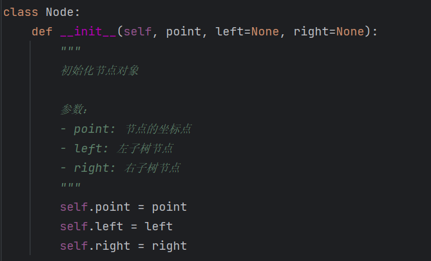

# ElasticSearch中高维数据的BKD树结构

###  KD树与BKD树简介

**BKD树**，全称为b-树形kd树（bushy kd-trees），是一种用于高维数据搜索的数据结构。它是基于kd树（k-dimensional tree）的改进版本。

#### KD树结构：
**kd树**是一种二叉树结构，将数据按特征空间划分区域，支持快速最近邻搜索。每个节点代表一个k维点，通过特征轴划分形成二叉树。搜索最近邻时，比较目标点与节点的特征值，沿树找到最近邻居节点。

不过，当数据进入高维度空间时，kd树的性能就会遭遇**滑铁卢**。这是因为在高维空间中，数据点之间的距离相差无几，这使得kd树难以进行有效的划分，进而导致搜索效率极度下降。为了破解这个难题，BKD树应运而生。
#### BKD树结构：
**BKD树**是一种在kd树基础上进行改进的数据结构。它通过对数据按照特征空间进行划分，将数据分别放置在不同的区域中。并且，BKD树为每个区域维护了一个**有序的列表**。 在搜索过程中，BKD树能够利用这些有序列表**快速定位**目标数据所在的区域。这大大提高了搜索的速度，使它成为一个非常高效的数据结构。

### BKD树的查询速度为什么这么快？
BKD树之所以迅速，是因为它具备了平衡性、数据局部性、剪枝策略和适应高维数据的特性。这些特性共同作用，使BKD树在搜索和查询方面表现出色。 

1. **平衡性**：BKD树通过在每个节点中选择中位数来划分数据，从而保持树的平衡。这意味着树的**高度相对较小**，查询时需要遍历的节点数量较少，从而加快了查询速度。

2. **数据局部性**：BKD树在构建过程中，将相似的数据项聚集在一起。这种数据的局部性使得在搜索时，只需**访问少量的节点**，减少了磁盘或内存的访问次数，提高了搜索效率。

3. **剪枝策略**：BKD树在搜索过程中采用了一些剪枝策略，即通过比较查询点与节点的边界距离，排除一些不可能包含查询点的节点，从而**减少了搜索的空间**。这种剪枝策略有效降低了搜索的复杂度，提高了查询速度。

4. **适应高维数据**：BKD树适用于高维数据，而高维数据往往具有一定的分布特点，如聚类和局部密度变化等。BKD树能够充分利用这些分布特点，**将相似的数据项聚集在一起**，从而提高了搜索的效率。

### ElasticSearch 如何利用BKD树对高维数据进行索引？

通过采用BKD树作为索引结构，ElasticSearch可以在高维空间中进行快速、准确的最近邻搜索，提高搜索效率和精度。

以**地理空间类型**数据为例： 假设我们有一个包含地理空间类型数据的索引，其中每个文档都包含一个地理坐标字段。我们可以使用BKD树来对这些地理坐标进行索引和搜索。 

首先，我们需要在索引中创建一个地理坐标字段的映射。例如，我们可以将该字段定义为**geo_point**类型：

``` python
PUT /my_index
{
  "mappings": {
    "properties": {
      "location": {
        "type": "geo_point"
      }
    }
  }
}
```

接下来，我们可以将地理坐标数据添加到索引中的文档中：
``` python
PUT /my_index/_doc/1
{
  "location": {
    "lat": 40.7128,
    "lon": -74.0060
  }
}

PUT /my_index/_doc/2
{
  "location": {
    "lat": 34.0522,
    "lon": -118.2437
  }
}

PUT /my_index/_doc/3
{
  "location": {
    "lat": 51.5074,
    "lon": -0.1278
  }
}
``` 
现在，我们可以使用BKD树来搜索地理空间类型数据。

例如，我们可以搜索距离某个特定坐标一定距离范围内的文档：

```  python
GET /my_index/_search
{
  "query": {
    "bool": {
      "filter": {
        "geo_distance": {
          "distance": "100km",
          "location": {
            "lat": 40,
            "lon": -70
          }
        }
      }
    }
  }
}
``` 
上述搜索将返回距离坐标(40, -70) 100公里范围内的文档。 

通过使用BKD树索引和搜索地理空间类型数据，Elasticsearch可以高效地处理高维数据，并提供准确的搜索结果。这对于许多应用程序，如地理位置服务和地理空间分析，非常有用。

### python实现BKD树算法原理
目标：在点集中找到与目标点一定距离内的所有点

首先，构建树节点：

其次，开始为数据构建BKD树：

最后，在BKD中进行范围搜索：


最终，在points中找到与target在一定距离内的点：

## 总结

由于BKD树具有很好的高维数据的搜索功能，在ElasticSearch中被用于**数字/地理位置**等数据类型的索引结构。

赶快来关注公众号【**AI财智通**】，一起从零开始学习ElasticSearch搜索和AI人工智能算法，探索更多有趣又实用的技术。

